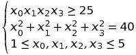

003-hs71
========

The goal is to implement and solve a small optimization problem.

This problem is the 71th problem of the Hock-Schittkowski-Collection
and is defined as:

...under the following constraints:

Step 1: Implement the cost function
-----------------------------------

Implement the cost function `F` by defining a function the same way than
in exercise 1.

The main difference is that now you have to implement a
`DifferentiableFunction` and not a `Function` which means you also
have to provide a way to compute the gradient.

Step 2: Implement the constraints
---------------------------------

Similarly, implement the constraints `G0` and `G1` corresponing to the
first two constraints.

The third constraint only put bounds on the optimization variables and
will be handled during problem instantiation.

Step 3: Create the problem
--------------------------

Instantiate the problem. Add the two necessary constraints. Display
the problem to check that everything is working fine.

Step 4: Solve it
----------------

Instiate a solver factory, a solver and solve the problem. Display the
solver object after solving the problem.

Executing the command `./003-hs71` should give you the following
output:

    Solver:
      Plugin: ipopt
      Problem:
        x₀ * x₃ * (x₀ + x₁ + x₂) + x₂ (twice differentiable function)
        Arguments bounds: (1, 5), (1, 5), (1, 5), (1, 5)
        Arguments scaling: 1, 1, 1, 1
        Number of constraints: 2
        Constraint 0
            x₀ * x₁ * x₂ * x₃ (twice differentiable function)
            Bounds: (25, inf)
            Scaling: 1
            Initial value: [1](25)
        Constraint 1
            x₀² + x₁² + x₂² + x₃² (twice differentiable function)
            Bounds: (40, 40)
            Scaling: 1
            Initial value: [1](52) (constraint not satisfied)
        Starting point: [4](1,5,5,1)
        Starting value: [1](16)
        Infinity value (for all functions): inf
      Result:
        Result:
          Size (input, output): 4, 1
          X: [4](1,4.743,3.82115,1.37941)
          Value: [1](17.014)
          Constraints values: [2](25,40)
          Lambda: [2](-0.552294,0.161469)
      Parameters:
        ipopt.acceptable_compl_inf_tol ("acceptance" threshold for the complementarity conditions): 0.01
        ipopt.acceptable_constr_viol_tol ("acceptance" threshold for the constraint violation): 0.01
        ipopt.acceptable_dual_inf_tol ("acceptance" threshold for the dual infeasibility): 1e+10
        ipopt.acceptable_iter (number of "acceptable" iterates before triggering termination): 15
        ipopt.acceptable_tol ("acceptable" convergence tolerance (relative)): 1e-06
        ipopt.compl_inf_tol (desired threshold for the complementarity conditions): 0.0001
        ipopt.constr_viol_tol (desired threshold for the constraint violation): 0.0001
        ipopt.derivative_test (enable derivative checker): none
        ipopt.dual_inf_tol (desired threshold for the dual infeasibility): 1
        ipopt.expect_infeasible_problem (enable heuristics to quickly detect an infeasible problem): no
        ipopt.file_print_level (verbosity level for output file): 5
        ipopt.hessian_approximation: limited-memory
        ipopt.linear_solver (linear solver): mumps
        ipopt.mu_strategy (update strategy for barrier parameter): adaptive
        ipopt.nlp_scaling_max_gradient (maximum gradient after NLP scaling): 100
        ipopt.nlp_scaling_method (technique used for scaling the problem internally before it is solved): gradient-based
        ipopt.option_file_name (file name of options file (to overwrite default)): 
        ipopt.output_file (file name of desired output file (leave unset for no file output)): 
        ipopt.print_level (output verbosity level): 5
        ipopt.print_options_documentation (switch to print all algorithmic options): no
        ipopt.print_user_options (print all options set by the user): no
        ipopt.start_with_resto (tells algorithm to switch to restoration phase in first iteration): no
        ipopt.tol (desired convergence tolerance (relative)): 1e-08
        max-iterations (number of iterations): 3000

    A solution has been found: 
    Result:
      Size (input, output): 4, 1
      X: [4](1,4.743,3.82115,1.37941)
      Value: [1](17.014)
      Constraints values: [2](25,40)
      Lambda: [2](-0.552294,0.161469)

[← Prev][ex2] | [Home][main] | [Next →][ex4]

 [main]: https://github.com/roboptim/roboptim-tutorial/
 [ex2]: https://github.com/roboptim/roboptim-tutorial/tree/master/src/002-operator
 [ex4]: https://github.com/roboptim/roboptim-tutorial/tree/master/src/004-bspline
