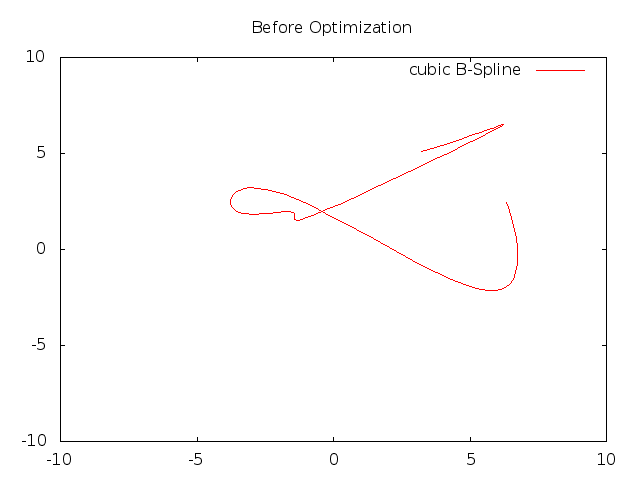

005-trajectory-optimization
===========================

In this last exercise, we will optimize a trajectory parameters.

The goal is to make sure that the trajectory stays at all time in a
particular box (actually a one dimensional constraint).

Step 1: create the curve
------------------------

Create a Cubic B Spline and display it. It will help us compare the
trajectory before and after optimization.

Step 2: write the constraint
----------------------------

The constraint will take a particular configuration as input
(i.e. size 2) and return the second element of the pair (i.e. the `y`
component).

This constraint is taking as input the trajectory evaluation, not the
trajectory parameters themself (i.e. we want to constraint the
trajectory itselfs, not the control points locations) and therefore is
a *State Function*.

I.e. a function which is to be applied to a trajectory state
(evaluation).

The `StateFunction` class takes as input the constraint, the
trajectory and a point to apply the constraint. The `StateFunction`
object takes the trajectory parameters as input and can directly added
a constraint to the problem.

Step 3: instantiate the problem
-------------------------------

We will not use a cost function in this case (i.e. use the null
function as cost function). Add the constraint implemented previously
and use the initial spline parameters as the starting point. Then
solve the problem.

Once this is done, display the spline again using the visualization
tools so that the two curves can be compared.

In the end, running `005-trajectory-optimization | gnuplot` shoud give you:

*Note:* the trajectories will change depending on how you implemented
 this exercise.

[← Prev][ex4] | [Home][main]

 [main]: https://github.com/roboptim/roboptim-tutorial/
 [ex4]: https://github.com/roboptim/roboptim-tutorial/tree/master/src/004-bspline
